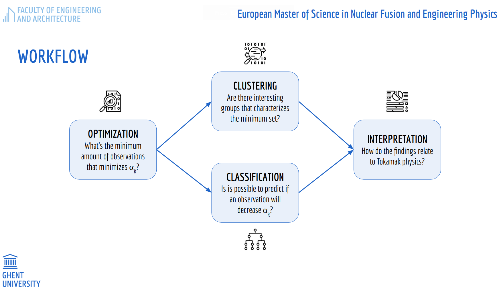

## Investigating the Dependence on Machine Size of the Energy Confinement in TOKAMAKs using Data-Driven Methods

#### General Remarks

In this repository, you can see the main progress of my thesis. These analyses are done with the aid of [Prof. Dr. Geert Verdoolaege](https://biblio.ugent.be/person/801001344620) and [PhD Student Joseph Hall](https://telefoonboek.ugent.be/nl/people/802003618944). As I progress on this project, I will be adding more information.

