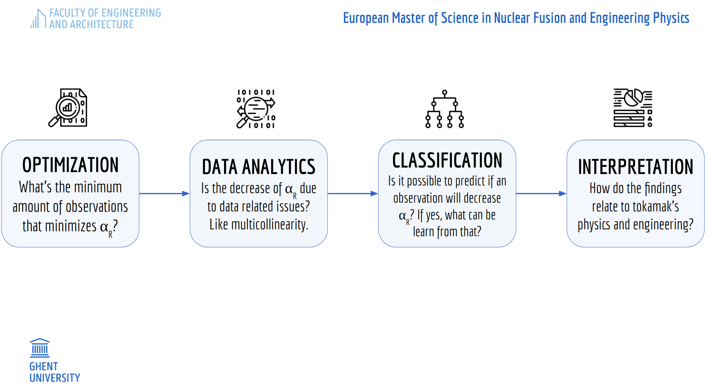

<h1>
Investigating the Dependence on Machine Size of the Energy Confinement in TOKAMAKs using Data-Driven Methods
</h1>

---
## [FUSION-EP master programme](https://www.em-master-fusion.org/), an Erasmus Mundus Joint Master Degree (EMJMD)
---

#### General Remarks

In this repository, you can see the main progress of my thesis. These analyses are done with the aid of [Prof. Dr. Geert Verdoolaege](https://www.researchgate.net/profile/Geert-Verdoolaege) and [PhD Student Joseph Hall](https://telefoonboek.ugent.be/nl/people/802003618944). As I progress on this project, I will be adding more information.

The project consists on investigating why the dependence of the machine size $\alpha_R$, of the energy confinement time:

$$
    \tau_{E,th} = \alpha_0 \cdot I_P^{\alpha_I} \cdot B_t^{\alpha_B} \cdot n^{\alpha_n} \cdot {P_{l,th}}^{\alpha_P} \cdot {R_{geo}}^{\alpha_R} \cdot {\kappa_{a}}^{\alpha_\kappa} \cdot \epsilon^{\alpha_\epsilon} \cdot {M_{eff}}^{\alpha_M},
$$

has decreased with the updated database [DB5 version 2.3](https://dataspace.princeton.edu/handle/88435/dsp01m900nx49h) if the standard criterium for selecting the datapoints to apply the regression remains the same. With ITER's design, it was noted that $\alpha_R \sim 2$; now, $\alpha_R \sim 1.4$.

    

    

## Visualization of Some Results

  
  
  
   
  <em>Complete dataset (left) vs dataset without spherical tokamaks (right) showing the normalized plasma beta (BETASTAR), normalized ion gyroradius (RHOSTAR), and normalized ion collision frequency (NUSTAR). At the bottom center is the complete dataset for an alpha-R of approx. 0.6357; for the plasma safety factor at the 95% poloidal flux surface (Q95), RHOSTAR and NUSTAR.</em>

Notice how spherical tokamaks can achieve notoriously high values of normalized plasma beta, compared to non-spherical ones. 

  

